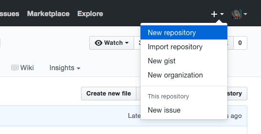
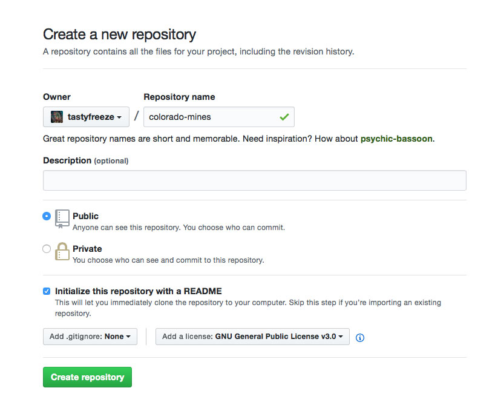
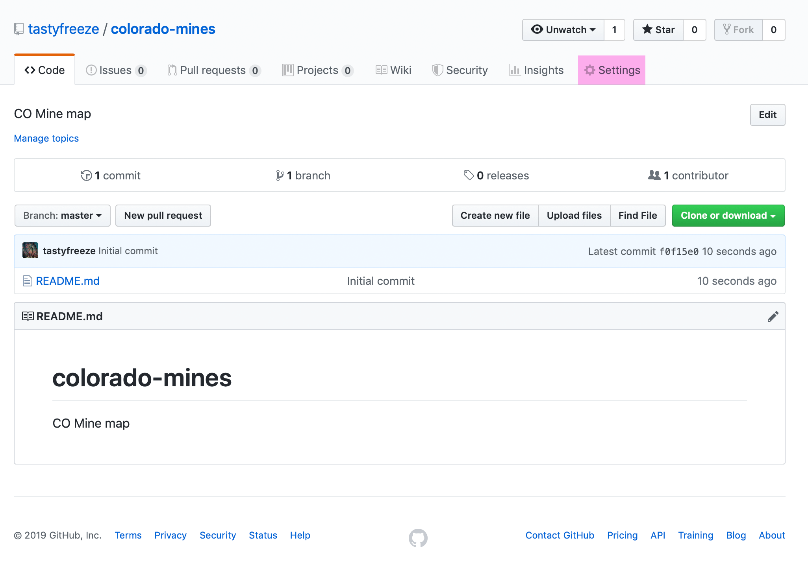
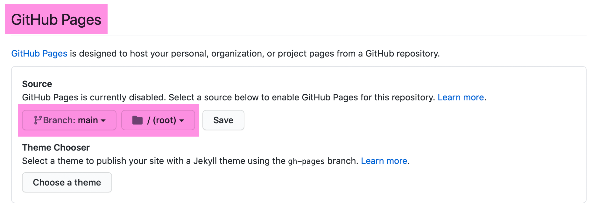
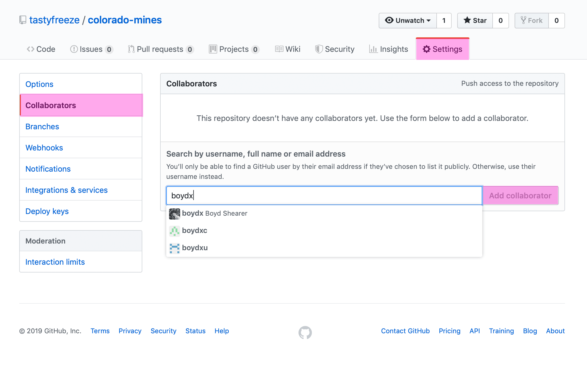

# Lesson 10: Final Project

<!-- TOC -->

- [Lesson 10: Final Project](#lesson-10-final-project)
    - [Overview](#overview)
        - [Data sources](#data-sources)
    - [Two options](#two-options)
        - [Static map option](#static-map-option)
        - [Embedded interactive Mapbox map option](#embedded-interactive-mapbox-map-option)
        - [Example](#example)
    - [Steps](#steps)
        - [1. Create a new repository](#1-create-a-new-repository)
        - [2: Enable GitHub Pages](#2-enable-github-pages)
        - [3: Invite your instructor as a Collaborator](#3-invite-your-instructor-as-a-collaborator)
        - [4: Design your map and web page](#4-design-your-map-and-web-page)
    - [Deliverables and deadlines](#deliverables-and-deadlines)

<!-- /TOC -->

## Overview

Welcome to your final project. The assignment is to make a compelling map that addresses a topic of your choice. The requirements are minimal, but your submission must be a web page that includes either a static map as image (PNG or JPG format) or an embedded Mapbox map. You will create a new repository for this project, publish it via GitHub Pages, and make your instructor a collaborator.

### Data sources

If you do not have data, consider perusing some [existing data resources and portals](https://github.com/rgdonohue/resources) collected by one of our professors at NMP. Often, a good dataset can drive inspiration and help you focus on telling a story, rather than trying to fix subpar data. Try to get your data early in the assignment, so you have plenty of time to map and analyze it.


## Two options

Your client has requested a web page showing the map. The map can either be static map or as an embedded Mapbox map.

Whichever option you select your map should be symbolized with a proper color scheme and icons, and present a well-organized layout with a meaningful title and appropriate legend. Please review previous labs to ensure you make a complete map.

Since your client is requesting a web page, both options should include information about the source of data, author, date of publication, and a brief description of your goals and methods of map making. Place this information in the content of your web page. The web page footer should contain your links to your snazzy social media footprint.

Use the previous labs to find an appropriate _index.html_ as a template for this web page or look in the [templates](templates) folder for starter HTML. You are free to modify these templates or create an entirely new design.  


### Static map option

* Map image format should be a PNG or JPG.
* Map needs to be in two resolutions: 1) width of 1,200 px and 2) width of 8,000 px


### Embedded interactive Mapbox map option

* Map needs to be an `iframe` element in the web page.
* A link should be provided to full-screen version.

### Example

Let's say you want to wanted to explore tornado history in the US from this dataset: http://www.spc.noaa.gov/gis/svrgis/. You can upload the data to Mapbox or make a beautiful static map in QGIS. Your repository name could be "us-tornado-map" and in that repo you would alter the _index.html_ to add your map image or embed the interactive Mapbox map.

## Steps

### 1. Create a new repository

Create a new repository on your personal GitHub account. Give the title of the repository a concise, meaningful name. For instance, if I'm going to map mines in Colorado, I would name the repository "colorado-mines" (no spaces!).

  
*Creating a new GitHub repository*
   
 Keep this repository public so your instructor and fellow classmates can offer help.  Click the box to include a README.md when you initially create the repository and include a license as well (GNU General Public License v3.0 is excellent). For example:

  
*Adding a public repository*


### 2: Enable GitHub Pages

[GitHub Pages](https://pages.github.com/) allows you to serve a repository as a web site. After you enable it, the URL for your page will be *https://username.github.io/repo-name*. First, access your new repo's settings.


  
*Access new repo settings*

Scroll down to the *GitHub Pages* section and enable it on the **main branch** in the **root** of the repository. Click **Save**.

  
*Enable GitHub Pages*

### 3: Invite your instructor as a Collaborator

Because this is your repository, you have control over who can collaborate. While still in your GitHub repo settings, find the **Collaborators** button. 


*Example of adding a repo collaborator*

Type your instructors GitHub username in the search field. When you find it, click **Add collaborator**. (Look on Canvas for your instructor's username.)

### 4: Design your map and web page

Add an HTML file with the name "index.html" in the root of your repository (the top level of your repository where the initial `README.md` is created). Use techniques discovered in previous modules to design your map and web page. Reach out to the instructor if you have a specific design request.


## Deliverables and deadlines

1. **Project setup** (6 pt)
    
    Send your instructor an invitation to collaborate in your repository by Friday. (Look on Canvas for your instructor's username.) Make sure your repository has a `README.md` that includes your project title and links to potential data sources. This information of course can change, we just want to see that you are working on your final project.


3. **Submit and discuss draft** (2 pt)
    
    Submit your GitHub Pages map URL to the Module 10 Discussion forum entitled, "Discussing your final project" by Sunday. In your post, you are encouraged to discuss your project and ask for input. What do you like about your map? What do you think needs improvement?

    Look through your classmates' submissions. Provide comments, suggestions, and/or praise for at least two other submissions by the following day.

2. **Add and submit project metadata** (2 pt)

    When you are finished with your project create a `publish.json` file in your code editor. This metadata file supports sharing your work with the world and controlling what information you present in a marker popup. This file will allow your project to contribute to our "map of maps", a map of New Maps Plus final projects. The link to the map is https://newmapsplus.github.io/projects/ and should give you an idea of what your previous classmates have made in NMP courses.


    The template file [can be found here](templates/publish.json) and it must be placed in the root directory of your repository (the top level of your repository where the initial `README.md` is created). Before you alter this file, look at the following properties that you need to change:

     ```js
    {
    // Required properties
    "title": "Title of Project", // Give your project a good title
    "info": "Add info about project", // A short blurb about your project
    "coordinates": [38, -84.5], // IMPORTANT: the lat, long centerpoint of your project

    // Optional properties
    // If you don't want to use these, use the value null without quotes.
    "author": "Do you want to add your name?", // What handle do you want to use?
    "link": "http://newmapsplus.uky.edu" // What's the link to the project or your social media?
    }
    ```

    Let's consider an example of a properly formatted `publish.json` file. Note that there are no comments in this version (a comment in this file is everything after, and including, the `//` the double forward slash). 

    ```js
    {
    "title": "A map of NMP students & alums",
    "info": "View where the NMP mappers live and work!", 
    "coordinates": [34.5, -94.5],
    "author": "My GitHub Handle", 
    "link": "https://newmapsplus.github.io/projects/alums/" 
    }
    ```

    Post the link to this file in Canvas. The link will have the format, ` https://username.github.io/my-final-project-repo/publish.json`. 